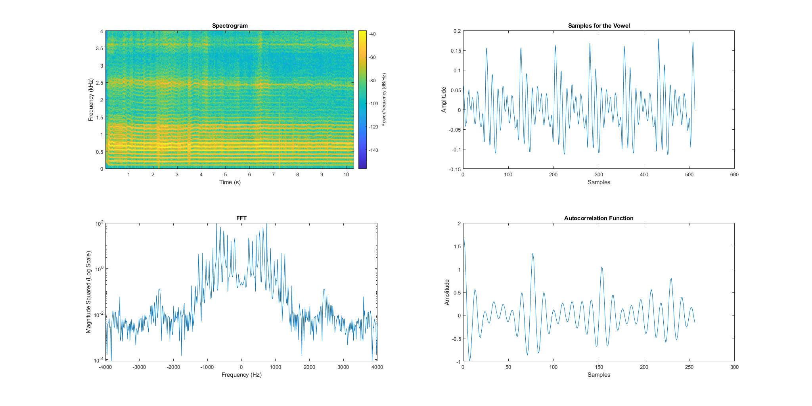

# Real-time Audio Analysis using STM32

We perform simple real-time audio analysis by implementing FFTs and Convolution from scratch on STM32F407 Discovery board. 
The audio is captured through the on-board microphone and buffered to perform the following techniques: 
- Vowel analysis: Estimating formant frequencies and pitch using autocorrelation.
- Real-time Spectrum Analyzer: Compute the real-time frequency response of the microphone audio and investigate windowing effects with Hamming and Hanning windows. 

The board is integrated with MATLAB and displays via MATLAB in real-time.

## Outputs

*Course Assignment for EEE591 - Real-time DSP*
